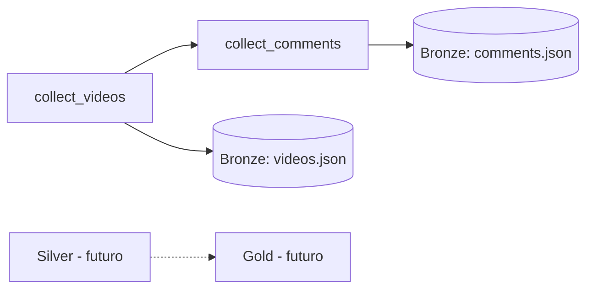

# Pipeline de dados - Ceara 2026

## Airflow

A DAG `youtube_pipeline` orquestra as duas etapas ja implementadas. Ela usa `PythonOperator` e chama diretamente as funcoes `collect_videos` e `collect_comments`; os argumentos de linha de comando dos scripts existem apenas para execucao manual e testes.



Para iniciar o Airflow, crie `tcc-engdados/.env` com `YOUTUBE_API_KEY=...` e execute:

```bash
docker compose up --build -d
```

Abra `http://localhost:8080` e entre com usuario `airflow` e senha `airflow`. Ative a DAG `youtube_pipeline` e dispare-a manualmente ou aguarde a agenda diaria.

O Compose define uma chave fixa compartilhada entre os componentes do Airflow para que o webserver consiga exibir os logs das tarefas. Apos alterar `docker-compose.yaml`, recrie os containers com `docker compose up -d --force-recreate`.

O servico `airflow-init` cria `data/` e ajusta automaticamente sua permissao para o usuario do Airflow. Nao e necessario executar `mkdir` ou `chmod` manualmente.

Cada execucao escreve artefatos separados em `data/bronze/<YYYY-MM-DDThh:mmTZD>/videos.json` e `comments.json`, por exemplo `data/bronze/2026-09-12T12:56Z/`. O timestamp e UTC e permite multiplas execucoes no mesmo dia.

O fluxo termina na Bronze por enquanto. Silver, Gold, PostgreSQL analitico, MinIO e Superset continuam planejados e nao fazem parte desta composicao.