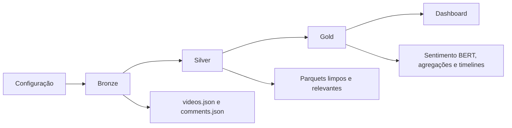

# Pipeline de Dados - Eleições Ceará 2026

Pipeline para coletar vídeos e comentários do YouTube, selecionar conteúdo eleitoral e gerar análises de sentimento e emoção. A execução é orquestrada pelo Airflow e o resultado pode ser explorado no dashboard Streamlit.


```mermaid
flowchart LR
    A[Configuração] --> B[Bronze]
    B --> C[Silver]
    C --> D[Gold]
    D --> E[Dashboard]
    B --> B1[videos.json e comments.json]
    C --> C1[Parquets limpos e relevantes]
    D --> D1[Sentimento BERT, agregações e timelines]
```

## Pré-requisitos

- Docker Engine com Docker Compose.
- Uma chave da YouTube Data API v3.
- Acesso à internet durante a coleta e na primeira carga do modelo BERT.

## Configuração

Na raiz do projeto, crie o arquivo `.env` com sua chave da API:

```dotenv
YOUTUBE_API_KEY=sua_chave_aqui
```

Os canais e os termos de relevância podem ser ajustados antes da coleta em:

- `settings/channels.json`
- `settings/relevance_terms.json`

## Executar tudo com Docker Compose

Suba todos os serviços com um único comando:

```bash
docker compose up --build
```

Para mantê-los em segundo plano:

```bash
docker compose up --build -d
```

O Compose inicia PostgreSQL, Airflow e o dashboard. Na primeira execução, o Airflow cria o banco e prepara as permissões do diretório `data/`.

| Serviço | Endereço | Credenciais |
| --- | --- | --- |
| Airflow | http://localhost:8080 | usuário `airflow`, senha `airflow` |
| Dashboard | http://localhost:8501 | não requer login |

Para acompanhar os serviços:

```bash
docker compose ps
docker compose logs -f airflow-scheduler
docker compose logs -f dashboard
```

Para encerrar o ambiente:

```bash
docker compose down
```

## Executar uma coleta

1. Abra o Airflow em http://localhost:8080.
2. Localize a DAG `youtube_pipeline`.
3. Clique em **Trigger DAG**.
4. Informe `start_date` e `end_date` no formato `YYYY-MM-DD`.
5. Aguarde a conclusão de todas as tarefas Gold.

A DAG não possui agendamento automático; cada coleta é disparada manualmente. As datas são inclusivas e usam UTC.

Exemplo de configuração para uma janela de dez dias:

```json
{
  "start_date": "2026-09-01",
  "end_date": "2026-09-10"
}
```

Na primeira execução Gold, o modelo `nlptown/bert-base-multilingual-uncased-sentiment` é baixado do Hugging Face. Esse download pode levar alguns minutos; login no Hugging Face não é necessário para esse modelo público.

## Estrutura de dados

Cada disparo tem um identificador de execução UTC e grava dados isolados por camada:

```text
data/
├── config/<run_id>/
├── bronze/<run_id>/
├── silver/<run_id>/
└── gold/<run_id>/
```

A camada Gold gera, entre outros, os seguintes artefatos:

- `comments_with_sentiment.parquet`: comentários com sentimento e emoção BERT.
- `serie_temporal_volume.parquet`: série diária de vídeos, comentários e engajamento.
- `candidatos_manifestacoes.parquet`: agregação de comentários por candidato.
- `temas_engajamento.parquet`: agregação por canal.
- `comentarios_gold_enriched.parquet`: comentários associados a canal, categoria e candidato.
- `candidatos_timeline.parquet` e `canais_timeline.parquet`: séries temporais usadas pelo dashboard.

## Dashboard

Abra http://localhost:8501 após uma execução completa. O menu lateral permite escolher qual `run_id` consultar; apenas execuções que possuem todos os artefatos Gold necessários aparecem no seletor.

As páginas disponíveis são:

- **Home**: indicadores gerais da execução.
- **Sentimentos**: distribuição, série temporal, emoções e amostra anonimizada.
- **Candidatos**: comparação de engajamento, sentimentos e evolução temporal.
- **Canais**: cobertura e engajamento dos canais de imprensa.

Os comentários exibidos no dashboard passam por anonimização de URLs, e-mails, menções, telefones e CPFs.

Mais detalhes sobre as visualizações estão em [docs/guia_dashboard.md](docs/guia_dashboard.md).

## Evidências de execução

As capturas abaixo registram o Airflow e o dashboard em execução local.


