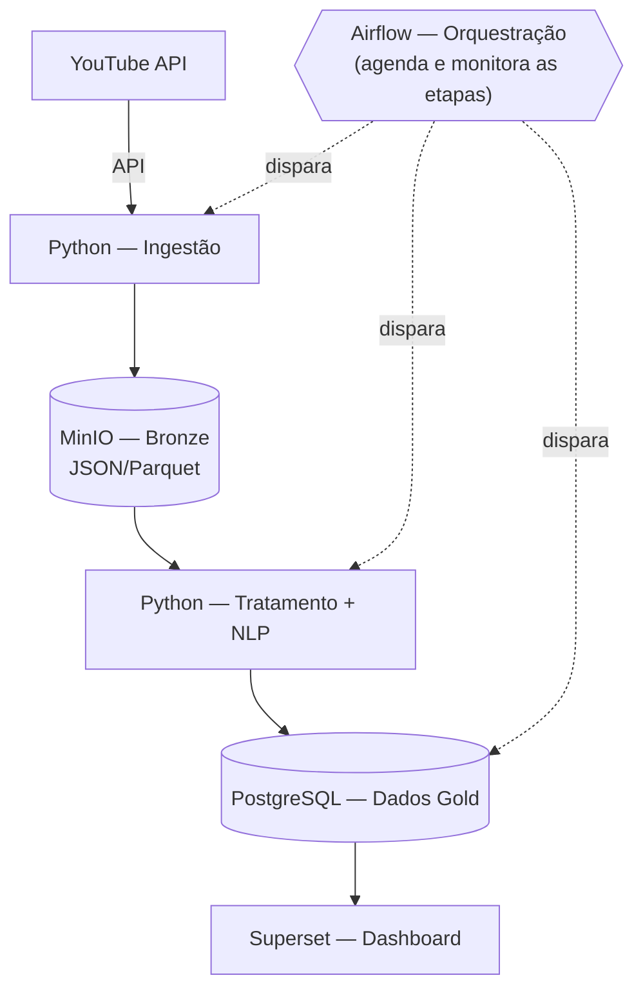

# Entrega 1 — Definição do Projeto

**Disciplina:** Projetos — Engenharia de Dados, Turma 2
**Equipe:** Morgana/Vitor
**Integrantes:** Morgana Araújo, Vitor Estevam
**Data:** 10/09/2026

**Projeto:** Ceará 2026 — Monitoramento do Engajamento Digital das Campanhas ao Governo

---

## 1. Problema e objetivo

Durante uma campanha eleitoral, uma grande quantidade de manifestações sobre candidatos, propostas e acontecimentos é publicada diariamente em diferentes plataformas digitais. Essas informações são distribuídas, possuem formatos diferentes e são difíceis de acompanhar de forma sistemática.

O projeto propõe uma solução de dados para coletar, consolidar e analisar manifestações públicas relacionadas às campanhas para o Governo do Ceará nas eleições de 2026, permitindo acompanhar a evolução do engajamento digital, os principais temas discutidos e a polaridade das manifestações ao longo do período eleitoral.

A solução será utilizada no contexto de uma consultoria de inteligência digital, que poderá utilizar os dados para responder perguntas como:

- Quais candidatos concentram maior volume de manifestações e interações?
- Quais temas geram maior engajamento?
- Como o volume de manifestações evolui ao longo do tempo?
- Qual a polaridade predominante das manifestações relacionadas a cada candidato e tema?
- Quais acontecimentos ou períodos estão associados a mudanças no volume de engajamento?

O projeto não tem como objetivo estimar intenção de voto ou prever o resultado da eleição. A análise será restrita aos dados públicos coletados e buscará representar o comportamento das manifestações digitais nas fontes selecionadas.

## 2. Fontes de dados

O MVP terá como principal fonte o YouTube, utilizando sua API para obter vídeos relacionados aos candidatos e suas respectivas interações públicas.

Serão coletados, quando disponíveis:

- identificação e título do vídeo;
- canal;
- data de publicação;
- visualizações;
- curtidas;
- comentários;
- respostas aos comentários;
- data das interações;
- texto dos comentários.

Os dados serão inicialmente obtidos em formato JSON por meio da API e posteriormente armazenados em formato Parquet. A coleta será realizada de forma periódica, inicialmente com frequência diária.

Como incremento futuro, poderá ser adicionada uma segunda fonte, como notícias de veículos públicos ou outra plataforma digital que disponibilize acesso adequado aos dados. Essa fonte não será uma dependência do MVP, reduzindo o risco de indisponibilidade de APIs, limitações de acesso ou bloqueios de coleta.

O volume inicial será dimensionado a partir de uma primeira extração da fonte, realizada antes da implementação definitiva do pipeline. Essa extração também servirá como evidência de acesso aos dados solicitada na entrega.

## 3. Arquitetura proposta

A arquitetura será composta por etapas de ingestão, armazenamento, processamento, análise e consumo dos dados:

As setas cheias representam o fluxo dos dados (ingestão → Bronze → tratamento/NLP → Gold → dashboard). O Airflow não é uma etapa do fluxo, e sim quem agenda, dispara e monitora cada uma dessas etapas (ingestão, tratamento/NLP e carga na camada Gold), tratando retries e falhas.

A camada Bronze manterá os dados em seu formato original ou próximo do original, enquanto as etapas de transformação irão limpar, padronizar e enriquecer os dados. Na etapa de NLP, os comentários poderão ser classificados por candidato, tema e polaridade.

## 4. Stack escolhida e justificativa

A solução utilizará principalmente tecnologias de código aberto e execução local por meio de Docker, reduzindo custos e facilitando a reprodução do projeto.

- **Python** será utilizado na coleta, transformação e processamento de textos devido ao seu amplo suporte para APIs, manipulação de dados e processamento de linguagem natural.
- **Airflow** será utilizado para orquestrar as etapas do pipeline, permitindo automatizar a coleta e o processamento, além de facilitar o acompanhamento das execuções.
- **MinIO** será utilizado como armazenamento de objetos, representando uma camada de Data Lake e permitindo separar os dados brutos dos dados processados.
- **Parquet** será utilizado para armazenamento dos dados devido ao seu formato colunar e à sua eficiência para consultas analíticas.
- **PostgreSQL** será utilizado para disponibilizar os dados tratados para consumo analítico.
- **Apache Superset** será utilizado para criação dos dashboards e visualização dos indicadores.

Para o volume esperado no MVP, não será utilizado processamento distribuído com o Spark. O uso de Python com Pandas ou Polars é suficiente e reduz a complexidade da solução, permitindo concentrar os esforços na qualidade dos dados, na análise textual e na construção dos indicadores.

## 5. Escopo

### MVP obrigatório

- Coleta de dados públicos do YouTube;
- armazenamento dos dados brutos;
- transformação e padronização dos dados;
- orquestração das etapas utilizando Airflow;
- análise de sentimento dos comentários;
- identificação/classificação básica de candidatos e temas;
- armazenamento dos dados tratados;
- indicadores de volume e engajamento;
- dashboard no Superset;
- execução automatizada e documentada do pipeline.

Os principais indicadores serão volume de comentários, visualizações, curtidas, respostas, evolução temporal, distribuição de sentimentos e relação entre candidatos, temas e engajamento.

### Incrementos opcionais

- inclusão de uma segunda fonte de dados;
- novos modelos de NLP;
- classificação mais detalhada de temas;
- detecção de spam;
- alertas de aumento anormal de engajamento;
- comparação entre diferentes fontes;
- análise de tópicos.

## 6. Divisão de responsabilidades

O projeto será desenvolvido por dois integrantes, com divisão por áreas, mantendo revisão conjunta das etapas.

- **Integrante 1 — Engenharia de Dados**: coleta e integração com a API, armazenamento no MinIO, estrutura dos arquivos Parquet, desenvolvimento do pipeline e DAGs do Airflow, tratamento dos dados, PostgreSQL e infraestrutura Docker.
- **Integrante 2 — Dados e Analytics**: preparação dos dados textuais, classificação de candidatos e temas, análise de sentimento, definição das métricas, validação dos resultados e construção do dashboard no Superset.

Ambos serão responsáveis pela documentação, validação do resultado e integração final da solução.

## 7. Riscos e plano B

Entre os principais riscos estão a indisponibilidade ou limitação da API, alterações nas fontes de dados, volume superior ao esperado e resultados inadequados do modelo de análise de sentimento.

Como plano de contingência, os dados coletados poderão ser armazenados para permitir o processamento mesmo durante períodos de indisponibilidade da fonte. Caso o volume aumente, será priorizado o processamento incremental e o uso de Parquet. Caso uma segunda fonte não possa ser acessada de forma confiável, ela será retirada do MVP sem comprometer a solução principal.

Também será considerada a limitação de que os dados coletados representam apenas as manifestações disponíveis nas fontes escolhidas e não constituem uma amostra estatisticamente representativa da população do Ceará. Além disso, sentimentos identificados automaticamente podem apresentar dificuldades em casos de ironia, sarcasmo ou contexto político.

## 8. Prova de acesso à fonte

[ ] To do
