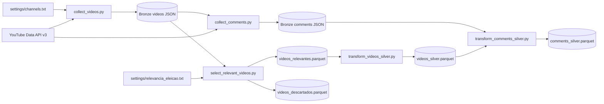

# Contexto operacional - TCC Ceara 2026

## Leia primeiro

Este documento descreve o estado atual da branch `airflow`, verificado em 20/09/2026.

- Projeto: **Ceara 2026 - Monitoramento do Engajamento Digital das Campanhas ao Governo**.
- Objetivo: acompanhar conteudo publico e engajamento digital no YouTube. O projeto nao estima intencao de voto nem preve resultado eleitoral.
- A Bronze coleta todos os videos acessiveis dos canais configurados desde 01/09/2026 e os comentarios/respostas acessiveis desses videos. Nenhum filtro tematico e aplicado durante a ingestao.
- A Silver seleciona videos relacionados a eleicao, padroniza dados de videos e comentarios e identifica candidatos citados nos metadados dos videos.
- Analise de sentimento, classificacao de temas, camada Gold, MinIO, PostgreSQL e Superset ainda nao foram implementados.
- Nunca registre, exiba ou versione `YOUTUBE_API_KEY`. A chave deve ficar em `.env` ou no ambiente.

## Estado atual verificado

| Etapa | Script ou tarefa | Entrada | Saida | Estado |
| --- | --- | --- | --- | --- |
| 1. Coletar videos Bronze | `src/collect_videos.py` | `settings/channels.txt` e YouTube Data API v3 | JSON Bronze de videos | Implementada e executada |
| 2. Coletar comentarios Bronze | `src/collect_comments.py` | JSON de videos e YouTube Data API v3 | JSON Bronze de comentarios | Implementada e executada |
| 3. Selecionar videos relevantes | `src/select_relevant_videos.py` | JSON Bronze de videos e `settings/relevancia_eleicao.txt` | Parquets de videos relevantes e descartados | Implementada e executada |
| 4. Transformar videos Silver | `src/transform_videos_silver.py` | `videos_relevantes.parquet` | `videos_silver.parquet` | Implementada e executada |
| 5. Transformar comentarios Silver | `src/transform_comments_silver.py` | JSON Bronze de comentarios e `videos_silver.parquet` | `comments_silver.parquet` | Implementada e executada |
| Orquestrar pipeline | `dags/youtube_pipeline.py` | Docker Compose, Airflow e os cinco estagios | Bronze e Silver por execucao | Implementada; nao validada neste ambiente sem Docker |

Artefatos locais da execucao mais recente:

- `data/videos/videos_20260919T153654Z.json`: 260 videos.
- `data/comments/comments_20260919T154501Z.json`: 30.162 comentarios e respostas de 260 videos.
- `data/silver/videos_relevantes.parquet`: 170 videos.
- `data/silver/videos_descartados.parquet`: 90 videos.
- `data/silver/videos_silver.parquet`: 170 videos transformados.
- `data/silver/comments_silver.parquet`: 12.567 comentarios transformados.

Os dados refletem o momento da coleta. Metricas de engajamento e a disponibilidade de videos/comentarios podem mudar no YouTube em execucoes futuras.

## Fluxo de dados



## Configuracao

### Canais

`settings/channels.txt` e a fonte de verdade para os canais ativos. Cada linha nao comentada usa:

```text
Nome da fonte|categoria|@handle-ou-channelId
```

Os canais atualmente configurados sao `Ciro Gomes|candidato|@CiroGomesOficial` e `Diario do Nordeste|imprensa|@diariodonordeste`. O identificador deve ser um handle iniciado por `@` ou um `channelId` iniciado por `UC`.

### Relevancia eleitoral

`settings/relevancia_eleicao.txt` lista termos de candidatos, vices e termos genericos. A selecao compara, sem diferenciar maiusculas/minusculas e acentos, os termos com titulo e descricao do video. Esta e uma regra lexical e pode gerar falsos positivos ou falsos negativos.

### Ambiente

Use Python 3.12 e instale as dependencias de `requirements.txt`:

```bash
python -m venv .venv
.venv/bin/python -m pip install -r requirements.txt
```

Crie `.env` na raiz do projeto, sem versiona-lo:

```text
YOUTUBE_API_KEY=sua_chave
```

## Como executar localmente

As etapas abaixo usam os destinos padrao sob `data/` na raiz deste repositorio.

```bash
python src/collect_videos.py
python src/collect_comments.py \
  --videos-file data/videos/videos_<timestamp>.json

python src/select_relevant_videos.py
python src/transform_videos_silver.py
python src/transform_comments_silver.py
```

Para processar somente uma extracao Bronze especifica, evitando misturar historico de execucoes, use os argumentos explicitos:

```bash
python src/select_relevant_videos.py \
  --videos-file data/videos/videos_<timestamp>.json \
  --output-dir data/silver/<run_id>

python src/transform_videos_silver.py \
  --input-file data/silver/<run_id>/videos_relevantes.parquet \
  --output-file data/silver/<run_id>/videos_silver.parquet

python src/transform_comments_silver.py \
  --comments-file data/comments/comments_<timestamp>.json \
  --videos-silver-file data/silver/<run_id>/videos_silver.parquet \
  --output-file data/silver/<run_id>/comments_silver.parquet
```

Cada coleta consome cota da API do YouTube. A coleta de videos percorre a playlist de uploads completa antes de filtrar a janela de datas; em canais com historico grande, essa etapa pode demorar.

## Orquestracao com Airflow

`docker-compose.yaml` define PostgreSQL, Airflow webserver e scheduler. A imagem usa `apache/airflow:2.10.5-python3.12` e instala `requirements.txt`. O Compose monta:

- `./dags` em `/opt/airflow/dags`;
- `./src` em `/opt/airflow/project/src`;
- `./settings` em `/opt/airflow/project/settings`;
- `./data` em `/opt/airflow/data`.

A DAG `youtube_pipeline` e diaria, sem `catchup`, com no maximo uma execucao ativa e duas tentativas por tarefa. Ela cria diretorios isolados por `logical_date`:

```text
data/bronze/<timestamp>/videos.json
data/bronze/<timestamp>/comments.json
data/silver/<timestamp>/videos_relevantes.parquet
data/silver/<timestamp>/videos_descartados.parquet
data/silver/<timestamp>/videos_silver.parquet
data/silver/<timestamp>/comments_silver.parquet
```

Ordem das tarefas:

```text
collect_videos -> collect_comments -> select_relevant_videos -> transform_videos_silver -> transform_comments_silver
```

O arquivo Compose e a DAG foram revisados, e as etapas Silver foram executadas localmente com os mesmos argumentos usados pela DAG. A inicializacao dos containers e a execucao da DAG ainda precisam ser validadas em uma maquina com Docker instalado.

## Contratos de dados

### Bronze de videos

O JSON contem `collected_at`, `collection_start`, `collection_end`, `video_count` e `videos`. Cada video possui `source`, `category`, `channel_id`, `channel_title`, `video_id`, `title`, `published_at`, `description`, `view_count`, `like_count`, `comment_count` e `privacy_status`.

### Bronze de comentarios

O JSON contem `collected_at`, `source_videos_file`, `video_count`, `comment_count`, `video_status` e `comments`. Cada comentario possui `comment_id`, `video_id`, `source`, `category`, `parent_id`, `published_at`, `updated_at`, `text` e `like_count`.

- `parent_id` e nulo em comentarios de nivel superior e aponta para o comentario pai em respostas.
- Falhas de API por video sao registradas em `video_status` e nao interrompem a coleta dos demais videos.
- Comentarios desabilitados podem aparecer como erros da API.
- Texto de comentario pode conter dados pessoais. Os dados nao sao anonimos e exigem controle de acesso e compartilhamento.

### Silver

- `videos_relevantes.parquet` e `videos_descartados.parquet` incluem os dados Bronze mais `matched_terms` e `source_file`.
- `videos_silver.parquet` inclui texto limpo, timestamps UTC, metricas de engajamento e `candidatos_mencionados`.
- `comments_silver.parquet` inclui texto limpo, timestamps UTC, `is_edited`, metricas e referencia ao arquivo fonte.
- As etapas Silver deduplicam por `video_id` ou `comment_id`, retendo a versao com `collected_at` mais recente quando processam diretorios com varias extracoes.

## Estrutura relevante

```text
tcc-engdados/
├── dags/youtube_pipeline.py
├── data/
│   ├── videos/
│   ├── comments/
│   ├── bronze/                # execucoes do Airflow
│   └── silver/
├── settings/
│   ├── channels.txt
│   └── relevancia_eleicao.txt
├── src/
│   ├── collect_videos.py
│   ├── collect_comments.py
│   ├── select_relevant_videos.py
│   ├── transform_videos_silver.py
│   ├── transform_comments_silver.py
│   └── silver/
├── docker-compose.yaml
├── Dockerfile
└── requirements.txt
```

## Limites conhecidos

- A API pode nao retornar videos privados, removidos, retidos, moderados ou comentarios desabilitados.
- Os resultados nao formam snapshot transacional: contadores e disponibilidade podem mudar durante a coleta.
- Os dados representam somente os canais configurados, nao uma amostra estatisticamente representativa da populacao do Ceara.
- A selecao de relevancia e baseada em termos; ainda nao existe classificacao semantica, de temas ou de sentimento.
- A chave da API foi exposta em historico anterior de terminal/ferramentas. Rotacione-a e restrinja-a no Google Cloud caso isso ainda nao tenha sido feito.
