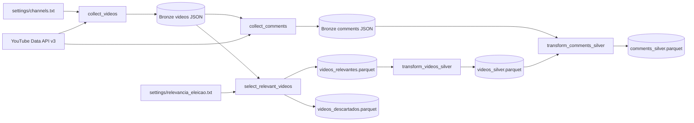

# Contexto Do Repositorio E Airflow

Atualizado em 25/09/2026. Este documento serve como handoff tecnico da conversa e descreve o estado observado no workspace neste momento. Quando houver conflito, o codigo atual e a fonte de verdade.

## Objetivo

O projeto monitora conteudo publico e engajamento no YouTube relacionado as campanhas para o Governo do Ceara em 2026. Ele nao estima intencao de voto nem faz previsoes eleitorais.

A arquitetura atual possui Bronze e Silver:

- Bronze: coleta videos publicados desde 01/09/2026 e seus comentarios/respostas acessiveis.
- Silver: seleciona videos por relevancia lexical e padroniza videos e comentarios em Parquet.
- Ainda nao existem Gold, analise de sentimento, classificacao de temas, MinIO, PostgreSQL analitico ou Superset.

## Estrutura

```text
tcc-engdados/
├── dags/youtube_pipeline.py       # orquestracao Airflow
├── src/
│   ├── collect_videos.py
│   ├── collect_comments.py
│   ├── select_relevant_videos.py
│   ├── transform_videos_silver.py
│   ├── transform_comments_silver.py
│   └── silver/
│       ├── cleaning.py
│       └── relevance.py
├── settings/
│   ├── channels.txt
│   └── relevancia_eleicao.txt
├── data/                          # saidas locais e volumes do Airflow
├── docker-compose.yaml
├── Dockerfile
└── requirements.txt
```

## Configuracao Atual

Os arquivos em `settings/` sao texto delimitado por `|`:

```text
# channels.txt
Nome da fonte|categoria|@handle-ou-channelId

# relevancia_eleicao.txt
tipo|rotulo|termo
```

`collect_videos.py` valida que cada canal possui tres campos preenchidos. `silver/relevance.py` exige tres campos e permite `rotulo` vazio para termos genericos. Os dois arquivos sao montados como somente leitura no container Airflow.

O segredo `YOUTUBE_API_KEY` deve existir apenas em `.env` ou nas variaveis de ambiente. Ele nao deve ser versionado, exibido em logs ou colocado em documentacao. Uma exposicao anterior no historico de terminal foi identificada; a chave deve ser rotacionada e restringida no Google Cloud se isso ainda nao tiver ocorrido.

## Pipeline De Dados



### 1. Videos Bronze

`src/collect_videos.py` resolve cada handle ou channel ID, percorre a playlist de uploads do canal e filtra videos entre `COLLECTION_START` (`2026-09-01T00:00:00+00:00`) e o momento da execucao. Depois busca metadados em lotes de ate 50 IDs.

O JSON de saida contem `collected_at`, `collection_start`, `collection_end`, `video_count` e `videos`. Cada video inclui origem, categoria, dados do canal, identificador, titulo, descricao, data de publicacao, contadores e status de privacidade.

### 2. Comentarios Bronze

`src/collect_comments.py` recebe o JSON de videos e coleta comentarios de primeiro nivel e respostas. Erros da API em um video sao registrados em `video_status`; os demais videos continuam sendo processados.

O JSON de saida contem `collected_at`, `source_videos_file`, contagens, `video_status` e `comments`. Comentarios podem conter dados pessoais e nao sao anonimizados.

### 3. Selecao De Relevancia

`src/select_relevant_videos.py` usa `silver.relevance` para comparar termos normalizados com titulo e descricao. A comparacao ignora maiusculas, minusculas e acentos. Ela gera:

- `videos_relevantes.parquet`
- `videos_descartados.parquet`

Cada registro preserva os dados Bronze e recebe `matched_terms` e `source_file`. Essa e uma regra lexical, sujeita a falsos positivos e falsos negativos.

### 4. Videos Silver

`src/transform_videos_silver.py` limpa titulo e descricao, padroniza timestamps em UTC, preserva metricas e cria `candidatos_mencionados` a partir dos termos de tipo `candidato` e `vice` encontrados na etapa anterior.

### 5. Comentarios Silver

`src/transform_comments_silver.py` limpa e padroniza os comentarios dos videos presentes em `videos_silver.parquet`. O resultado e `comments_silver.parquet`.

As transformacoes Silver deduplicam por `video_id` ou `comment_id`, mantendo o registro com `collected_at` mais recente quando recebem diretorios com mais de uma extracao.

## Execucao Local

O projeto requer Python 3.12 e as dependencias em `requirements.txt`: cliente da API do YouTube, dotenv, pandas e pyarrow.

```bash
python -m venv .venv
.venv/bin/python -m pip install -r requirements.txt

python src/collect_videos.py
python src/collect_comments.py --videos-file data/videos/videos_<timestamp>.json
python src/select_relevant_videos.py
python src/transform_videos_silver.py
python src/transform_comments_silver.py
```

Para evitar combinar extracoes historicas, as etapas Silver aceitam caminhos explicitos de arquivos e diretorios. A coleta de videos percorre toda a playlist de uploads antes de filtrar a janela, o que pode consumir tempo e cota em canais grandes.

## Integracao Com Airflow

O ambiente Docker usa `apache/airflow:2.10.5-python3.12`, com PostgreSQL 16 e `LocalExecutor`.

O Compose monta:

- `./dags` em `/opt/airflow/dags`;
- `./src` em `/opt/airflow/project/src` como somente leitura;
- `./settings` em `/opt/airflow/project/settings` como somente leitura;
- `./data` em `/opt/airflow/data` para persistir saídas.

A DAG `youtube_pipeline` esta em `dags/youtube_pipeline.py`. No estado atual ela possui `schedule="@daily"`, `catchup=False`, `max_active_runs=1` e duas tentativas por tarefa, com atraso de cinco minutos.

Ela usa `logical_date` para compor um `RUN_ID` UTC e grava cada execucao em diretorios isolados:

```text
data/bronze/<timestamp>/videos.json
data/bronze/<timestamp>/comments.json
data/silver/<timestamp>/videos_relevantes.parquet
data/silver/<timestamp>/videos_descartados.parquet
data/silver/<timestamp>/videos_silver.parquet
data/silver/<timestamp>/comments_silver.parquet
```

Ordem atual das tarefas:

```text
collect_videos -> collect_comments -> select_relevant_videos -> transform_videos_silver -> transform_comments_silver
```

`collect_videos` e `collect_comments` usam `PythonOperator`; as tres etapas Silver usam `BashOperator`, executando os scripts em `src/` com arquivos da execucao como argumentos.

O Compose foi revisado e os comandos Silver ja foram exercitados localmente. A inicializacao completa dos containers e uma execucao real da DAG ainda nao foram confirmadas neste ambiente: uma tentativa de `docker compose up` foi interrompida manualmente.

## Historico De Decisoes Da Conversa

Os itens abaixo foram discutidos ou implementados em uma iteracao anterior, mas nao fazem parte do estado atual observado. Sao contexto para uma futura retomada, nao uma descricao do comportamento atual.

- Foi adicionada temporariamente uma janela configuravel de coleta com `--start-date` e `--end-date`, para consultar um intervalo delimitado, em vez de 01/09/2026 ate agora. O codigo atual voltou a usar `COLLECTION_START` fixo e o instante atual como fim.
- Foi proposta uma DAG manual (`schedule=None`) com parametros `start_date`, `end_date`, `channels` e `relevance_terms` no formulario de trigger do Airflow. A DAG atual voltou a `@daily` e nao define esses parametros.
- Os settings foram migrados temporariamente para `channels.json` e `relevance_terms.json`, com listas estruturadas e um exemplo de payload de trigger. No workspace atual, esses arquivos e o diretorio `config/` nao existem; os `.txt` voltaram a ser a fonte de verdade.
- Para preservar rastreabilidade de overrides por execucao, foi criado temporariamente um primeiro stage `prepare_run_settings`, que gravava os valores efetivos em `data/config/<run_id>/`. Esse stage foi movido de `dags/callables/` para `src/prepare_run_settings.py`, mas nao existe no estado atual e nao e importado pela DAG.
- O modulo compartilhado `src/pipeline_config.py`, criado para validar os JSONs, foi removido por ser redundante quando os arquivos de configuracao ja eram fornecidos prontos.

Se a configuracao estruturada voltar a ser desejada, a direcao acordada foi: usar JSON versionado como default, aceitar apenas payloads estruturados em `dag_run.conf` (nunca caminhos fornecidos pelo usuario) e, opcionalmente, salvar o payload efetivo por execucao para lineage. Isso precisa ser reimplementado e testado contra a DAG atual.

## Validacoes Ja Realizadas

Em iteracoes anteriores foram executados com sucesso:

- compilacao Python (`python -m compileall`);
- `git diff --check`;
- execucao local das etapas Silver com dados reais;
- teste sem rede da filtragem de datas, que persistiu apenas videos dentro da janela;
- validacao do leitor de JSON estruturado e do snapshot de configuracao por run, quando essa variante existia.

Os resultados historicos de uma execucao local foram 260 videos coletados, 30.162 comentarios/respostas, 170 videos relevantes, 90 descartados e 12.567 comentarios Silver. Esses valores sao historicos e podem variar em execucoes futuras.

## Limites E Proximos Pontos De Atencao

- A API pode omitir videos privados, removidos, moderados ou retidos, e comentarios desabilitados causam erros por video.
- Metricas e disponibilidade no YouTube mudam ao longo do tempo; nao ha snapshot transacional.
- Os dados cobrem apenas canais configurados e nao sao uma amostra representativa da populacao do Ceara.
- A relevancia atual e baseada em palavras-chave, nao em classificacao semantica.
- Antes de novas mudancas, confirme se a intencao e manter o estado atual (diario e `.txt`) ou retomar o desenho de runs manuais, intervalo de datas e configuracao JSON estruturada.