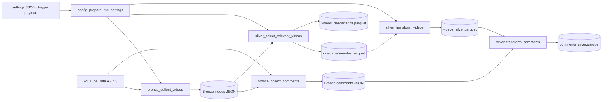

# Contexto Do Repositorio E Airflow

Atualizado em 28/09/2026. Este documento descreve o estado atual do codigo. Quando houver conflito, o codigo e a fonte de verdade.

## Objetivo

O projeto monitora conteudo publico e engajamento no YouTube relacionado as campanhas para o Governo do Ceara em 2026. Nao estima intencao de voto nem faz previsoes eleitorais.

A pipeline possui Bronze e Silver:

- Bronze: coleta videos em uma janela UTC e comentarios/respostas acessiveis desses videos.
- Silver: seleciona videos por relevancia lexical e padroniza videos e comentarios em Parquet.
- Gold, analise de sentimento, classificacao de temas, MinIO, PostgreSQL analitico e Superset ainda nao foram implementados.

## Estrutura Ativa

```text
tcc-engdados/
├── dags/youtube_pipeline.py
├── settings/
│   ├── channels.json
│   └── relevance_terms.json
├── src/
│   ├── prepare_run_settings.py
│   ├── bronze_collect_videos.py
│   ├── bronze_collect_comments.py
│   ├── silver_select_relevant_videos.py
│   ├── silver_transform_videos.py
│   ├── silver_transform_comments.py
│   └── silver/
│       ├── cleaning.py
│       └── relevance.py
├── data/
├── docker-compose.yaml
├── Dockerfile
└── requirements.txt
```

Os arquivos sem prefixo de camada ainda presentes em `src/` sao legados; a DAG importa somente os seis modulos listados acima. Eles devem ser removidos ou mantidos como wrappers em uma limpeza dedicada, apos confirmar que nao ha consumidores externos.

## Configuracao

Os defaults versionados sao arquivos JSON em `settings/`:

```json
{
  "channels": [
    {"source": "Nome da fonte", "category": "categoria", "identifier": "@handle"}
  ]
}
```

```json
{
  "relevance_terms": [
    {"type": "candidato", "label": "Nome", "term": "termo"},
    {"type": "termo_eleicao", "label": "", "term": "eleicao 2026"}
  ]
}
```

`identifier` aceita um handle iniciado por `@` ou um `channelId` iniciado por `UC`. Os termos usam `candidato`, `vice` ou `termo_eleicao`; o rotulo pode ser vazio apenas para termos genericos.

`YOUTUBE_API_KEY` deve existir em `.env` ou no ambiente. A chave nao deve ser versionada, exibida em logs ou incluida na documentacao.

## Fluxo De Dados


```mermaid
flowchart LR
    CFG["settings JSON / trigger payload"] --> P["config_prepare_run_settings"]
    P --> V["bronze_collect_videos"]
    API["YouTube Data API v3"] --> V
    V --> BV[("Bronze videos JSON")]
    BV --> C["bronze_collect_comments"]
    API --> C
    C --> BC[("Bronze comments JSON")]
    BV --> R["silver_select_relevant_videos"]
    P --> R
    R --> VR[("videos_relevantes.parquet")]
    R --> VD[("videos_descartados.parquet")]
    VR --> VS["silver_transform_videos"]
    P --> VS
    VS --> SV[("videos_silver.parquet")]
    BC --> CS["silver_transform_comments"]
    SV --> CS
    CS --> SC[("comments_silver.parquet")]
```

1. `bronze_collect_videos` resolve os canais, percorre suas playlists de uploads, filtra a janela informada e grava metadados em JSON.
2. `bronze_collect_comments` coleta comentarios de primeiro nivel e respostas. Falhas de API por video sao registradas e nao interrompem os demais videos.
3. `silver_select_relevant_videos` compara titulo e descricao normalizados com os termos de relevancia e produz Parquets de videos relevantes e descartados.
4. `silver_transform_videos` limpa textos, padroniza timestamps em UTC e cria `candidatos_mencionados`.
5. `silver_transform_comments` mantem apenas comentarios de videos Silver, limpa textos e identifica edicoes.

## Airflow

O Compose usa `apache/airflow:2.10.5-python3.12`, PostgreSQL 16 e `LocalExecutor`. Ele monta `dags/`, `src/` e `settings/` em modo leitura e persiste `data/` em `/opt/airflow/data`.

A DAG `youtube_pipeline` nao possui agendamento automatico (`schedule=None`), permite uma execucao ativa e faz duas tentativas por tarefa. Todas as tarefas usam `PythonOperator`:

```text
config_prepare_run_settings
-> bronze_collect_videos
-> bronze_collect_comments
-> silver_select_relevant_videos
-> silver_transform_videos
-> silver_transform_comments
```

Os parametros do formulario ou do `dag_run.conf` sao:

- `start_date`: data inicial UTC, formato `YYYY-MM-DD`.
- `end_date`: data final UTC inclusiva, formato `YYYY-MM-DD`.
- `channels`: lista opcional que sobrescreve `settings/channels.json` apenas nessa execucao.
- `relevance_terms`: lista opcional que sobrescreve `settings/relevance_terms.json` apenas nessa execucao.

`prepare_run_settings` materializa os valores efetivos em um diretorio por `logical_date`:

```text
data/config/<timestamp>/channels.json
data/config/<timestamp>/relevance_terms.json
data/bronze/<timestamp>/videos.json
data/bronze/<timestamp>/comments.json
data/silver/<timestamp>/videos_relevantes.parquet
data/silver/<timestamp>/videos_descartados.parquet
data/silver/<timestamp>/videos_silver.parquet
data/silver/<timestamp>/comments_silver.parquet
```

Esse snapshot preserva quais canais e termos foram usados em cada run. A DAG nao aceita caminhos de arquivo fornecidos no trigger.

## Execucao Local

O projeto requer Python 3.12 e as dependencias em `requirements.txt`.

```bash
python -m venv .venv
.venv/bin/python -m pip install -r requirements.txt

python src/bronze_collect_videos.py --start-date 2026-09-01 --end-date 2026-09-20
python src/bronze_collect_comments.py --videos-file data/videos/videos_<timestamp>.json
python src/silver_select_relevant_videos.py
python src/silver_transform_videos.py
python src/silver_transform_comments.py
```

Para rodar o Airflow, crie `.env` com `YOUTUBE_API_KEY` e execute:

```bash
docker compose up --build
```

O ambiente fica disponivel em `http://localhost:8080`, com usuario e senha `airflow`. A inicializacao completa dos containers e uma execucao real da DAG ainda devem ser confirmadas no ambiente alvo.

## Limites E Pontos De Atencao

- A API pode omitir videos privados, removidos, moderados ou retidos. Comentarios desabilitados geram erro por video.
- Metricas e disponibilidade no YouTube mudam com o tempo; nao ha snapshot transacional.
- Os dados cobrem somente os canais configurados e nao representam a populacao do Ceara.
- A relevancia e baseada em palavras-chave; ainda nao ha classificacao semantica ou de sentimento.
- A coleta percorre toda a playlist de uploads antes de filtrar a janela, o que pode consumir tempo e cota em canais grandes.
