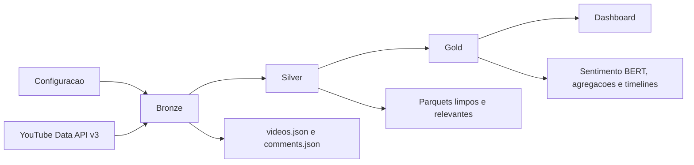

# Contexto do Repositorio e Airflow

Atualizado em 30/09/2026. Este documento descreve a implementacao atual; em caso de divergencia, o codigo e a fonte de verdade.

## Objetivo

O projeto monitora conteudo publico e engajamento no YouTube relacionado as campanhas para o Governo do Ceara em 2026. Ele organiza os dados nas camadas Bronze, Silver e Gold, e disponibiliza os resultados em um dashboard Streamlit.

O projeto nao estima intencao de voto nem produz previsoes eleitorais.

## Arquitetura Ativa


```mermaid
flowchart LR
    A[Configuracao] --> B[Bronze]
    B --> C[Silver]
    C --> D[Gold]
    D --> E[Dashboard]
    Y[YouTube Data API v3] --> B
    B --> B1[videos.json e comments.json]
    C --> C1[Parquets limpos e relevantes]
    D --> D1[Sentimento BERT, agregacoes e timelines]
```

```text
tcc-engdados/
+-- dags/youtube_pipeline.py
+-- dashboard/
|   +-- streamlit_app.py
|   +-- pages/
|   `-- utils/data_loader.py
+-- docs/
+-- settings/
|   +-- channels.json
|   `-- relevance_terms.json
+-- src/
|   +-- prepare_run_settings.py
|   +-- bronze_collect_videos.py
|   +-- bronze_collect_comments.py
|   +-- silver_select_relevant_videos.py
|   +-- silver_transform_videos.py
|   +-- silver_transform_comments.py
|   +-- gold_add_sentiment.py
|   +-- gold_create_temporal_series.py
|   +-- gold_create_aggregations.py
|   `-- gold_enrich_datasets.py
+-- data/
+-- docker-compose.yaml
+-- Dockerfile
`-- requirements.txt
```

Arquivos antigos sem o padrao de nomes por camada podem permanecer em `src/` por compatibilidade, mas a DAG usa somente os modulos listados acima.

## Configuracao

Os canais e os termos de relevancia sao versionados em `settings/channels.json` e `settings/relevance_terms.json`.

```json
{
  "channels": [
    {"source": "Nome da fonte", "category": "categoria", "identifier": "@handle"}
  ]
}
```

```json
{
  "relevance_terms": [
    {"type": "candidato", "label": "Nome", "term": "termo"},
    {"type": "termo_eleicao", "label": "", "term": "eleicao 2026"}
  ]
}
```

`identifier` aceita um handle iniciado por `@` ou um `channelId` iniciado por `UC`. Os termos aceitos sao `candidato`, `vice` e `termo_eleicao`.

Crie o arquivo `.env` na raiz com a chave da API:

```dotenv
YOUTUBE_API_KEY=sua_chave_aqui
```

A chave nao deve ser versionada, exibida em logs ou incluida em documentacao.

## Airflow e Execucao

O Compose usa `apache/airflow:2.10.5-python3.12`, PostgreSQL 16 e `LocalExecutor`. A DAG `youtube_pipeline` nao possui agendamento automatico, permite uma execucao ativa e realiza duas tentativas por tarefa.

Inicie o ambiente completo com:

```bash
docker compose up --build
```

Servicos locais:

| Servico | Endereco | Credenciais |
| --- | --- | --- |
| Airflow | http://localhost:8080 | usuario `airflow`, senha `airflow` |
| Dashboard | http://localhost:8501 | nao requer login |

Para executar a coleta, abra a DAG `youtube_pipeline` no Airflow, clique em **Trigger DAG** e informe a janela UTC. Os parametros aceitos sao:

- `start_date`: data inicial, no formato `YYYY-MM-DD`.
- `end_date`: data final inclusiva, no formato `YYYY-MM-DD`.
- `channels`: lista opcional que substitui os canais padrao somente naquela execucao.
- `relevance_terms`: lista opcional que substitui os termos padrao somente naquela execucao.

A cadeia atual de tarefas e:

```text
config_prepare_run_settings
-> bronze_collect_videos
-> bronze_collect_comments
-> silver_select_relevant_videos
-> silver_transform_videos
-> silver_transform_comments
-> gold_add_sentiment
-> gold_create_temporal_series
-> gold_create_aggregations
-> gold_enrich_datasets
```

## Dados por Execucao

Cada execucao recebe um `run_id` UTC derivado da data logica do Airflow. Configuracoes e dados ficam isolados para permitir rastreabilidade e consultas reproduziveis.

```text
data/
+-- config/<run_id>/
+-- bronze/<run_id>/
+-- silver/<run_id>/
`-- gold/<run_id>/
```

Principais artefatos:

- Bronze: `videos.json` e `comments.json`.
- Silver: `videos_relevantes.parquet`, `videos_descartados.parquet`, `videos_silver.parquet` e `comments_silver.parquet`.
- Gold: `comments_with_sentiment.parquet`, `serie_temporal_volume.parquet`, `candidatos_manifestacoes.parquet` e `temas_engajamento.parquet`.
- Gold para o dashboard: `comentarios_gold_enriched.parquet`, `candidatos_timeline.parquet` e `canais_timeline.parquet`.

O estagio Gold usa `nlptown/bert-base-multilingual-uncased-sentiment` para o sentimento dos comentarios e gera campos de emocao. Na primeira execucao, o modelo e baixado do Hugging Face; isso pode prolongar a tarefa, especialmente em CPU.

## Dashboard

O dashboard Streamlit le somente dados Gold e Silver do `run_id` selecionado. O seletor lateral lista apenas execucoes que possuem todos os artefatos necessarios.

As paginas sao:

- **Home**: indicadores gerais e resumo de sentimentos.
- **Sentimentos**: distribuicao, evolucao temporal, emocoes e amostra anonimizada.
- **Candidatos**: comparacao de engajamento e sentimentos por candidato.
- **Canais**: cobertura e engajamento dos canais de midia.

Os comentarios exibidos passam por anonimizacao de URLs, e-mails, mencoes, telefones e CPFs. Consulte [guia_dashboard.md](guia_dashboard.md) para detalhes das visualizacoes.

## Limites e Pontos de Atencao

- A API pode omitir videos privados, removidos, moderados ou retidos; comentarios desabilitados falham por video sem interromper toda a coleta.
- Metricas e disponibilidade no YouTube mudam com o tempo; nao existe snapshot transacional da plataforma.
- Os dados cobrem somente os canais configurados e nao representam a populacao do Ceara.
- A relevancia e baseada em palavras-chave configuradas, portanto pode incluir falsos positivos ou deixar conteudo relevante de fora.
- O sentimento e uma classificacao automatica e deve ser interpretado como sinal analitico, nao como avaliacao definitiva de opiniao politica.
- A coleta percorre playlists de uploads antes de filtrar a janela, o que pode consumir tempo e cota em canais grandes.